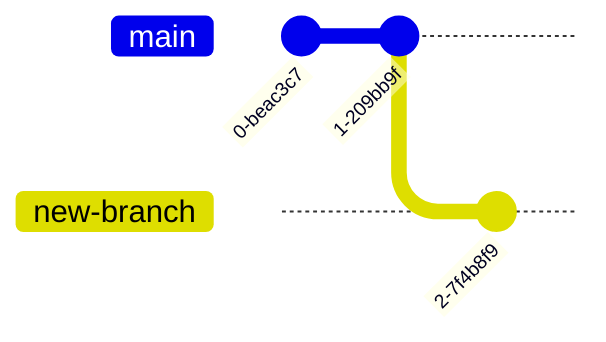

Git concepts, terminology, and commands can be confusing and intimidating at first. Here is a hopefully helpful reference glossary of some of most of the important terms.

For a more in-depth explanation of git concepts, *Atlassian*'s [git guides](https://www.atlassian.com/git/tutorials/what-is-version-control) are excellent resources, including a [cheat sheet](https://www.atlassian.com/git/tutorials/atlassian-git-cheatsheet) for common commands.

Terms are grouped by topic below.

## General

### Version Control System (VCS)

A system/syntax for tracking changes to a codebase over time. Git is a VCS. The main alternatives to git are Subversion (SVN) and Mercurial (Hg).

### Git

Git is a _version control system_ that tracks and organizes changes in a codebase mainly via its system of commits and branches.

### GitHub

An online service that hosts git repositories.

### Directed Acyclic Graph (DAG)

In a git repo, commits are organized via a directed acyclic graph (DAG) that conveys the commit history.

- A _directed graph_ is a collection of nodes and edges, where each edge has a direction. In a git repo, the nodes are commits, and the edges convey a parent-to-child relationship.

- An _acyclic graph_ is a directed graph that does not contain any cycles. A _cycle_ is a path of edges that starts and ends at the same node. In a git repo, a cycle would represent a commit that is a successor of itself, which is impossible.

## Core Git Concepts

### Commits

A _commit_ is a snapshot of the state of your codebase at a given point in time. Commits are made by running the command `git commit -m "commit message"`, which forms a new snapshot that is labeled as the successor to the previous commit:


Use `git log` to view the commit history of your repository.

#### SHA
A unique identifier (SHA) is generated and assigned to each commit.

#### Commit messages

The commit message is a short description of the changes you made in the commit so that others can review the changes you made in your code.

##### Conventional Commits

**Conventional commits** are commits that feature commit messages that follow this specific format:

```
commit-type(qualifier): commit message
```

Where `commit-type` is one of: `feat` (feature), `fix`, `docs`, `style`, `refactor`, `perf` (performance), `test`, `build`, `ci`, `chore`, or `revert`.

The `(qualifier)` portion of the message is optional, and can be any string that helps to further describe the commit. The `commit message` portion is simply the body of your commit message as usual.

The `feat` and `fix` commit types are special because they can convey the information needed to apply [semantic versioning]() to a project's git history.

The rest of the commit types are helpful reminders and guardrails for the types of changes and the scope of changes that should be self-contained a commit.

Read more at [conventionalcommits.org](https://www.conventionalcommits.org/).

#### Staging with `git add`

The command `git add <file-name-or-pattern>` adds a file or set of files to the _staging area_. The _staging area_ may be thought of as a holding place for files that are ready to commit (and will be committed if a commit is performed).

Beginners with git might struggle to see the value in the `add` command and the staging area, because it's often convienent to "forget" to add a file to the staging area until we are ready to commit all of our changes. However, efficient use of the staging area can go a long way towards helping you maintain a clean commit history.

The primary thing to keep in mind is that commits should be scoped to the smallest self-contained changes possible, so that our git history is reviewable and useful. When you commit, you should be thinking about how easy it should be to trace changes through the commit tree. However, adding to the staging area takes a little less commitment... no pun intended 🙂

Here are a few example scenarios that might help illustrate how the process of staging files can be helpful:

- You are working on a large feature that requires changes to many files. You finish working on some files before others. Staging your "ready-to-go" files lets you better focus on the unstaged changes still in progress in your working tree, especially when using `git diff` and other operations where you are reviewing your changes.
- You are working on a file and want to preserve the state of the file as a "checkpoint," but you don't want to commit the changes because it would commit would occur while the repo in a broken state. By staging a partial change, any subsequent changes to the file will be tracked separately from the staged changes, and you can easily revert to the staged changes if you need to.
- You perform some work on your code, but you realize that the work is better split up logically into two commits rather than one. You can add and commit the first set of changes first, and then add and commit the second set of changes separately.

### Branches

The command `git branch <branch-name>` creates a new branch in your repository, branching off of your currently active branch.

The command `git switch <branch-name>` switches your active branch to `<branch-name>`. At this point, any commits you make will be added to the end of the branch you switched to.



A branch can be thought of as an alternate pathway of changes to your codebase. When you switch branches, your IDE or whatever program is reading code from the repo will completely switch the active files (i.e., the one that shows up in your filesystem or code editor) to the version of the files in the latest commit of branch you switched to, while hiding the code in the non-active branches within the git filesystem. The state of the (committed) files in the branch you switched from will be saved, and you can pull them back up again by switching back to the branch.

!!! Tip "git switch vs git checkout"

    Most tutorials on the internet use the command `git checkout` to switch branches. However, `git checkout` is a flexible command that can be used to do things besides switching branches, such as integrating a specific file from a different branch into your current branch. The command `git switch` is a newer command that is more explicit about its purpose, and we will use this command for class.

### HEAD

HEAD is fancy name for a "pointer" that labels the latest commit on the branch that you currently have checked out. You'll use this when you want to refer to that commit specifically, like if you want to revert your code to the checkpoint two commits ago, you can use `git reset HEAD~2` to reset your code to the commit that HEAD pointed to two commits ago.

### `git reset`

There are three types of resets: `--soft`, `--hard`, and `--mixed` (the default). Generally, a reset moves your HEAD pointer to a different commit, modifying the commit history to an earlier commit. The various types of resets apply these changes to the staging area and working tree as well. If you find yourself needing to perform a reset and needing to understand the difference between the options, check out this intro from [Atlassian](https://www.atlassian.com/git/tutorials/undoing-changes/git-reset).


### Repositories, remotes, cloning, and origin

A repository is a collection of files and their commit history. Repositories are stored on a remote server, and can be cloned to your local machine. The command `git clone <repo-url>` clones a repository to your local machine. Cloning a repository creates a local copy of the repository on your machine, and sets up a remote called `origin` that points to the remote repository. The remote repository is usually hosted on a service like GitHub, GitLab, or BitBucket.

### Stashing

`git stash` is a very useful command to store changes in a temporary holding area. This is useful when you want to switch branches, but don't want to commit your changes yet. You can stash your changes, switch branches, and then pull your changes back up again when you're ready. This is also useful when you want to pull changes from a remote repository, but don't want to commit your changes yet. You can stash your changes, pull the changes from the remote, and then pull your changes back up again when you're ready. Very helpful for avoiding unnecessary merge conflicts.

### Merging

`git merge <branch-name>` incorporates the changes from `<branch-name>` the currently checked out branch. It's often used to combine changes from different people, or it might be used to combine changes from same person who working on different features on different branches.

### Fetch vs pull

`git fetch` downloads changes from a remote repository, but does not merge them into your active branch right away. It stores the updates from the remote locally in special remote branches that you can see with `git branch -r`. `git pull` is simply a shortcut for a `git fetch` followed by a `git merge`.
