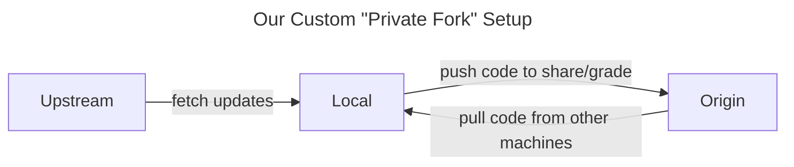
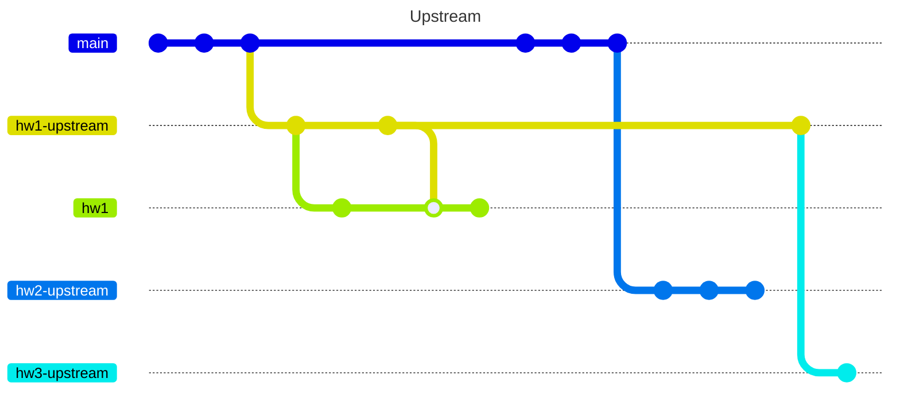

This section provides a comprehensive overview of our course's git strategy, which is designed to provide a simple, flexible, and secure way for students and instructors to coordinate on code.

## The "Private Fork"

A common pattern that teams use when collaborating on code on GitHub is to have contributors make *forks* of the repository. That way programmers can host their own versions of the original repository on their personal GitHub accounts, which is useful for experimenting on your code and using GitHub features without affecting the original repository. Forks are also useful for making pull requests to the original repository, which is a common way to contribute to open source projects.

Unfortunately, we can't use a basic *fork* setup because we need each student to have a private repo only visible to them and the instructor for academic integrity, but GitHub forces all forks to have the same permissions as the original repository, meaning anyone with a fork can view anyone else's fork. Thus, we need to work around this limitation by setting up a modified version of a fork using some tailored, slightly more complicated manual steps.

The specific git commands we perform to set up our architecture were borrowed from answers in [this Stack Overflow thread](https://stackoverflow.com/a/30352360/1526293), adapted to fit our classroom situation.

Here are the main requirements of our git/repository setup:

- Starter code can be provided in a repository visible to all students. Students should be able to pull the repository at any time, so that they

    1.  Can pull the starter code for an assignment
    2.  Can pull updates and hotfixes to an assignment they've already pulled
    3.  Are blocked from pushing modifications directly to the template code

- Each student has full administrative rights for a "private" repository in the `wustl-data` GitHub organization where they can host a copy of their code visible only to instructors.
- Students can easily flex full control over the syncing of the two _remote_ repositories and the _local working copy_ with simple commands.

## Remote Repositories

Local copies of a git repository may be mapped to one or more _remote_ repositories hosted on the Internet. The most common use case for this is to have a local copy of a repository on your machine that is mapped to a remote repository on GitHub. This allows you to push your local changes to GitHub (where it can serve as a backup or be reviewed by others) and pull changes from GitHub (such as those from a collaborator, or work you did on a different machine) to your local machine.

You can list your local repository's remote repositories with the command `git remote`. Most of the time, repos will only have one remote named `origin`- this is the name that is assigned to the _remote_ which you cloned the repo from.

We want our `origin` repo to be the private submission repo, but we also want a remote named `upstream` that maps to the [fl23 course repository](https://github.com/wustl-data/fl23).

### Commands

Here are some important commands for managing _remotes_:

- List remotes:

    ```bash
    git remote
    ```

- Add a remote repository:

    ```bash
    git remote add <remote_name> <remote_url>
    ```

- Remove a remote repository:

    ```bash
    git remote remove <remote_name>
    ```

- Check a remote's URL:

    ```bash
    git remote get-url <remote name>
    ```

- Modify the remote for a given remote name:

    ```bash
    git remote set-url <remote name> <url>
    ```

To add our course repo as a remote, you will likely want to run:

```bash
git remote add upstream https://github.com/wustl-data/fl23.git
```
## Repos & their branches

Generally, our setup consists of 3 versions of the repository (a repository is usually defined by its initial commit). Each repository will contain its own set of branches, and you should understand how these branches relate to each other in our git setup.

### Template `upstream` repo

- on GitHub, owned by the `wustl-data` organization
- Students get read-only access
- New content and corrections are shared here
- Provides starter code for assignments
- Branches:
    - `main`: Provided as a starting point for assignments; contains baseline configurations such as a default `pyproject.toml`, `.gitignore`, `devcontainer.json`, a default folder structure, etc.
    - `hw*-upstream` branches (* replaced with the assignment number): Contains the starter code for each assignment. "Hotfix" updates to assigments will also be pushed to these branches.

### Local Repo

- Here, _local_ means on your machine, whether that machine is running on Codespaces in the cloud or on your actually-local machine.
- Branches:
    - `main`: Ideally, this branch should be a mirror of the `main` branch on the template repo. Generally, will try to `optimize` this branch with updates as I find configurations that I think work better for the class. If you're templating your own projects it might be helpful to use `main` as a reference or branching point. However, it generally doesn't matter if you have the latest changes on here, since important changes will be merged with the `hw*-upstream` branches.
    - `hw*` branches: Split these branches off of their corresponding `hw*-upstream` branches to start working on an assignment. You will push the code from these branches to your private repo. Creating this branch separate from the `hw*-upstream` branch help keeps the upstream branch clean so that you can pull changes to it without risk of merge conflicts. If upstream changes do conflict with changes you've already made, it's easier to handle this merge on two local branches than between a local branch and a remote branch.
    - `hw*-upstream`: Ideally, a mirror of the upstream branch. This branch is created locally when you pull it from the upstream repo. When hotfixes to an assignment are made, ideally you will switch to this branch, pull the changes, switch to your `hw*` branch and decide how you want to incorporate any changes.
- The commands to manipulate them appropriately.

### Private `origin` Repo (On GitHub, owned by you)

- In addition to being the repo where you make your submissions and the autograder is run, you can also use this repo to synchronize versions of your code between people or machines. For example:
    - If I make a change directly to your code (e.g., to help you fix a bug) and push it to your `origin` repository, you might want to `pull` those changes into the machine that you're working on.
    - If you're working on your assignment from a Codespace but you're traveling to somewhere with a poor internet connection, you might want to push your code to your `origin` repo so that you can pull it down to your local machine and work on it in a local devcontainer.
- Branches:
    - `main` branch: This branch should be a mirror of the `main` branch upstream. You should rarely need to push `main` to `origin`, since you should generally be pushing your `hw*` branches
    - `hw*` branches: Where your code should be pushed for a check against the autograder or for sharing the state of your code with an instructor.

## Visual Representations

### Repo Flowchart



### Git Graph



!!! tip "Mermaid and Markdown"

    To build cool figures like these with the ease of writing Markdown, check out [Mermaid](https://mermaid.js.org/)!

    _Markdown_ is a simple syntax for taking plaintext notes or writing plaintext docs in an intuitive way, which may then be used by tooling to convert the text to formatted HTML. It's the same syntax you see if you try to edit a README on GitHub, and it's used to write most of the pages on our course website. Check out the source code of this page to see the syntax!
