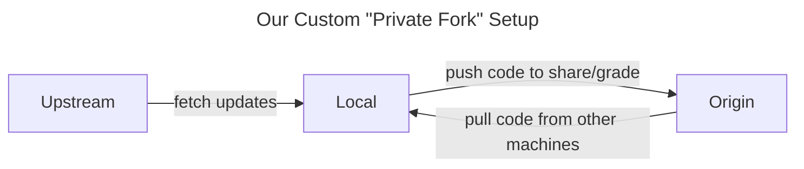
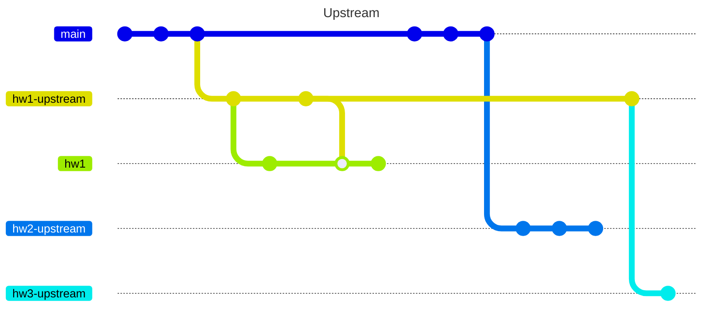

This section provides a comprehensive overview of our course's git strategy, which is designed to provide a simple, flexible, and secure way for students and instructors to coordinate on code.

## The "Private Fork"

A common pattern that teams use when collaborating on code on GitHub is to have contributors make *forks* of the repository. That way programmers can host their own versions of the original repository on their personal GitHub accounts, which is useful for experimenting on your code and using GitHub features without affecting the original repository. Forks are also useful for making pull requests to the original repository, which is a common way to contribute to open source projects.

Unfortunately, we can't use a basic *fork* setup because we need each student to have a private repo only visible to them and the instructor for academic integrity, but GitHub forces all forks to have the same permissions as the original repository, meaning anyone with a fork can view anyone else's fork. Thus, we need to work around this limitation by setting up a modified version of a fork using some tailored, slightly more complicated manual steps.

The specific git commands we perform to set up our architecture were borrowed from answers in [this Stack Overflow thread](https://stackoverflow.com/a/30352360/1526293), adapted to fit our classroom situation.

Here are the main requirements of our git/repository setup:

- Starter code can be provided in a repository visible to all students. Students should be able to pull the repository at any time, so that they
  1.  Can pull the starter code for an assignment
  2.  Can pull updates and hotfixes to an assignment they've already pulled
  3.  Are blocked from pushing modifications directly to the template code
- Each student has full administrative rights for a "private" repository in the `wustl-data` GitHub organization where they can host a copy of their code visible only to instructors.
- Students can easily flex full control over the syncing of the two _remote_ repositories and the _local working copy_ with simple commands.

## Repos and Branches

The next two sections are outlined as follows:

1. Repos
    1. Starter/Template/Upstream Repo (On GitHub, owned by the "organization")
        - Branches you expect to see on this repo
    2. Local Repo
        - Branches you expect to see on this your local version of the repo
        - The commands to manipulate them appropriately.
    3. Personal Repo (On GitHub, owned by you)
        - Branches you expect to see on this repo
        - Useful GitHub features for your repo

!!! info "Vocab check"

    Git-speak can take some getting used to, so don't fret. Check out the Git [Glossary](glossary.md) I've compiled for your reference.

## Visual Representations

We will go into the details of the following figures in each section, but they are presented here for you to review for some high-level context before digging in.

### Repo Flowchart

### Git Graph

!!! tip "Mermaid and Markdown"

    To build cool figures like this with the ease of writing Markdown, check out [`Mermaid`](https://mermaid.js.org/). Markdown a simple syntax around HTML formatting attributes. It's the same syntax you see if you try to edit a README on GitHub, and it's used to write most of the pages on our course website. Try editing this page to see!
