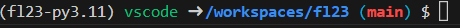

# Dev Env Setup

Follow these instructions to set up and test your development environment:

## Prepare GitHub

1. Visit our course's [GitHub Organization](https://github.com/wustl-data) and make sure you are a member by confirming the presence of the **fl23** repository in the "pinned" section. If you have not been added, please send your GitHub username in an email to the instructor.

2. Create a repository for your homework submissions by clicking the green "New" button under *Repositories*. Name your repository with your WUSTL username. Select **private** visibility so other students may not see your submissions. Don't add a README, .gitignore, or license file through the UI: these are provided by the class template repo.

3. Make sure you have [Git Credential Manager](https://github.com/git-ecosystem/git-credential-manager/blob/release/docs/install.md) installed. Follow the instructions for your operating system. OSX users should make sure they have [Homebrew](https://brew.sh/) installed, and Windows users should make sure to follow the WSL addendum in the instructions if you are using WSL/Ubuntu.

## Template (upstream) repo --> personal repo


??? warning "Windows Users"

    A large number third party software libraries, including libraries that are commonly used in this course, assume UNIX-style terminal commands. MacOS and Linux terminals are considered UNIX terminals, but Powershell on Windows is not. As a minor example, if you are using Windows, commands in this documentation like `cd` (change directory) and `rm -rf` (remove all folder contents) might not work.

    Historically, this has often been worked around by either *emulating* a UNIX terminal with a program such as _Git Bash_, or by installing/dual-booting a full Linux/Ubuntu OS alongside your Windows OS.

    However, Windows has recently made it extremely easy to run a fully-featured Linux OS from the Windows Terminal via **Windows Subsystem for Linux (WSL)**.

    Windows users, especially if you think you will be working with local dev containers instead of Codespaces (see considerations [below](#codespaces-cloud-or-local-dev-container)), are **strongly advised** to install the [Windows Subsystem for Linux (WSL)](https://learn.microsoft.com/en-us/windows/wsl/setup/environment) for their main terminal, following the documentation for integrating Visual Studio Code, git, and Docker. If this is undesirable for you, you may need to troubleshoot your own installation methods.

1. Populate your private repo with the code from the upstream repository by executing the following commands in your terminal.

    1. Clone the template repo to a temporary folder named `fl23.git`:

        ```bash
        git clone --bare https://github.com/wustl-data/fl23
        ```

        ```mermaid
        flowchart LR
        template([fl23]) -->|clone| local([Your Local Repo])
        ```

    2.  Move your _current directory_ to the cloned repo's folder

        ```bash
        cd fl23.git
        ```

    3.  Push a version of the repo to your private repo, replacing `<your wustl username>` with your actual WUSTL username to match the repo you created earlier.

        ```bash
        git push --mirror https://github.com/wustl-data/<your wustl username>
        ```

        ```mermaid
        flowchart LR
        template([fl23])--> local([Your Local Repo])
        local-->|push| origin([Your Private GH Repo])
        ```

    4.  Go back to your original working directory (`..` goes up one level in the filesystem hierarchy).

        ```bash
        cd ..
        ```

    5.  Delete your local version of the template repo

        ```bash
        rm -rf fl23.git
        ```

        ```mermaid
        flowchart LR
        origin([Your Private GH Repo])
        ```

## Codespaces (cloud) or local dev container?

Choose whether to work on the cloud in a Codespaces environment or on your local machine and follow the appropriate instructions for the rest of this exercise. You might want to try both and see which one you like better, and you may switch between the two options at any time.

Here are some considerations:

- **Cloud (Codespaces)**: No manual setup needed -- You can launch a codespace from any code branch within the GitHub UI. By default, VS Code opens in the browser, but you can open the code in your desktop version at any time through menu options. Codespaces are free for the class. You can keep your work preserved and easily access your environment on different machines, even across different branches of code, and you can have multiple instances of your environment running at once. However, you will need to be connected to the internet to work on your code. Frequently, GitHub's servers are fast enough to outperform personal computers for computation.

- **Local Dev Container**: Takes some manual configuration and interfacing with Docker to get set up. Provides the comfort of a stable and accessible home for your code on your machine.

- **Manual setup**: Requires you to manually install all the dependencies on your local machine. This is the most flexible option, but it is also the most time consuming and error prone.

## Clone and open your private repo (hw0-upstream branch)

=== "Codespaces"

    1. Go to your private repo on GitHub.
    2. Codespaces will build the environment from your currently selected branch, so select the `hw0-upstream ` branch in your branch selection dropdown menu.
    3. Click the green "Code" button and open a Codespace from the branch. Ideally your Codespace does not take too long to load but may require some time to load when a Codespace is first created. (This load time will be much shorter when you re-open this codespace; the build step only happens for new containers.) After the Codespace is created, an in-browser version of VS Code will open to your project directory with all of the necessary dependencies installed in the environment.

    > Note: Previous versions of the codespace instructions did not specify switching branches before creating a codespace. Generally, it's ok to switch branches after creating a codespace, but creating a codespace directly from a branch is the most sure-fire way to ensure that the Codespace is loaded as intended.

=== "Local Dev Container"

    1. Make sure you have Docker Desktop and VS Code installed. In VS Code, download the Dev Containers extension.

    2. Clone your private repo to your local machine by visiting the repo on GitHub, clicking the green "Code" button, and copying the https URL in the "Local" tab. Then, in your terminal, run `git clone <url>` to clone the repo to your local machine. This will create a folder named after your repo in your terminal's current directory.

    3. Open the repo in VS Code.

        === "OSX"
            Use the VS Code GUI to open the folder containing the repo you just cloned.

        === "WSL"
            `cd` to the repo directory and run `code .` to open the repo in VS Code.

    4. When VS Code opens, it should prompt you to open the folder in a Dev Container. Accept the prompt and wait for the container to build. This may take a few minutes the first time. If you miss the prompt, you can open the command palette (Ctrl+Shift+P) and search for "Reopen in Container".

    5. Switch to the `hw0-upstream` branch and create a `hw0` branch

        1. Run `git branch -a` to list all of your remote and local branches. `remotes/origin/hw0-upstream` should be listed.
        2. Create a local version of the `hw0-upstream` branch and switch to it by running `git switch -t origin/hw0-upstream` to create and switch to the contents of the upstream branch. The `-t` flag sets the version of the branch in your `origin` repository as the tracking branch for your local branch. This means that when you run `git pull` or `git push` without specifying a branch, git will know which branch to pull from or push to, and the remote tracking branch is also the version of the branch that your local version is compared to when you run `git status`.

## Create `hw-0` branch

Now, run `git switch -c hw0` to create a new branch named `hw0` off of your current branch and switch to it. The `-c` part of the command is the `create` flag for the `git switch` command. Finally, run `git push -u origin hw0` to push the branch to your origin (private) repo. Similarly to `git switch`'s `-t` flag, `git push`'s `-u`/`--set-upstream` flag sets the tracking branch for your local branch, so that you can use `git pull` and `git push` without specifying the branch name.

Review the page on our [git strategy](../background/dataops/3-git-strategy.md) if you need a refresher on why we keep hw0-upstream and hw0 branches separate.

??? Warning "Upstream?"

    Even though the the `-u` flag in `git push -u origin hw0` stands for `upstream` (the verbose version of the flag is `--set-upstream`), it is not the same concept of _upstream_ as when we refer to our `upstream` repo (The course `fl23` "template" repo) and its `hw*-upstream` branches. The branch linked with the `-u` flag should be more accurately referred to as the `remote tracking branch`. In a future exercise, we will explicitly add the `fl23` repo as a _remote_ to our local repo, and we will name it `upstream`.

## Test your assignment

1. Run the following commands in the terminal to test your setup:

    ```bash
    pytest
    ```

    This should show a failing test

    ```
    pre-commit run --all-files

    ```

    This should run our _pre-commit hooks_ which will help provide you with code feedback before you commit your code. If you need to, get your code to pass the checks before continuing.

2. Add pandas to your project's dependencies.

    ```bash
    poetry add pandas
    ```

3. Run `pytest` again to see if your test output is any different from before. If you are still getting `ModuleNotFound` errors, check out the tip below.

    ??? tip "Virtual Environments with Poetry"

        Poetry does a few different things, but one of its jobs is to manage *virtual environments*. Generally speaking, virtual environments define a specific version of python as well as any package dependencies that are installed for a project. If you want to see what a *virtual environment* looks like under the hood, open the `.venv` folder in the root of your project and poke around. You'll see some important binary files (`bin` folder), some third party libraries (`lib` folder), and some metadata (`pyvenv.cfg` file).

        By keeping these folders separated on your machine for each project, we can switch back and forth between various projects (or versions of a project) and their dependencies without worrying about conflicts or the need to reinstall or uninstall packages for compatibility.

        Almost always, you can tell if a virtual environment is active by looking at your terminal prompt. If you see something like `(fl23-py3.11)` at the beginning of your prompt, the project's virtual environment is active! If you don't see that, you can activate one by running `poetry shell` from the root of your project. We'll learn more about other Poetry commands as we go along.

        

## Commit changes to `pyproject.toml` and `poetry.lock`

??? tip "Orient Yourself"

    The key to getting more comfortable with git, poetry, etc is to know what to do when you get stuck or don't know where to go next. Here are some helpful commands that you should run **very frequently** before and after performing operations on your git gree or virtual environment. This should help you gain an intuition on what these operations are doing.

    - **git status**: Tells you what files have been changed since your last commit, what files are staged for commit, and what files are untracked. If your branch is attached to a remote tracking branch, it will also tell you if your local branch is ahead or behind the remote branch.
    - **git log**: Shows you the commit history for your current branch.
    - **git diff**: Shows you the changes you've made since your last commit. Generally, I find it more convenient to use the GUI for this.
    - **git branch**: Shows you what branches exist in your local repo and which one you are currently on. The `-a` flag will show you all branches, including remote branches.
    - **poetry show**: Shows you what packages are installed in your virtual environment.
    - **poetry env info**: Shows you information about your virtual environment, including the location of the virtual environment on your machine.
    - **poetry env list**: Shows you all of the virtual environments that poetry knows about on your machine.

    Also likely to help is the usage of a GUI for git operations. While comfort with the command line is a valuable career skill, helpful for programming efficiency, and a marker of [technical sophistication](https://www.learnenough.com/command-line-tutorial#aside-technical_sophistication), using GUI tools can help you focus on concepts instead of command-line syntax. Here are some options:
    - VS Code's built in Git GUI is okay for staging, committing, and pushing code, but you can get a much clearer picture of your git tree using the GitLens extension for VS code, which will be installed by default in our Dev Containers in all future versions. Non-WSL users might also like using GitHub Desktop to manage their git repos; this is one of the few cases where I've been unable to cleanly install a software tool with WSL, but hopefully they will add support for it soon.

1. Use git commands to stage (`git add`) and commit (`git commit`) your changes to `pyproject.toml` and `poetry.lock`. For some brief notes on what these commands are doing, see the [git glossary](../background/dataops/4-glossary.md).

    ??? info "pyproject.toml & poetry.lock"

        `pyproject.toml` is a configuration file for Poetry. It defines the project's dependencies, build instructions, and other metadata for various tools. Importantly, it's designed to be human readable and lets you define an "acceptable" range of package verions you might require for your project. `poetry.lock` is a bit different; it's a "machine-readable" file that defines the exact versions of the packages according to the way that Poetry _resolved_ the dependencies.

        For example: say you specify "any version greater than 1.0" for a package e.g. Pandas. However, there is a separate package (say, Plotly), that requires "any version less than 2.0" of Pandas. Poetry will resolve this conflict by installing the latest version of Pandas that satisfies both requirements. By including a `poetry.lock` file in our repository, we can make sure that everyone is using the same versions of the packages we are using. Additionally, it helps us save time when we're installing the packages because Poetry doesn't need to take the extra time to perform the dependency resolution; it just uses what's in `poetry.lock` when you run `poetry install`.

## Make the test pass

9. Make the test pass by implementing a function that returns a blank dataframe. First, make sure you understand Python's import structure, referring to the tip below if necessary. Once you understand how imports and functions work, and you're still not sure how to proceed, try deducing next steps from your test output. Once the test is passing, stage your changes and attempt a commit.

??? tip "Python modules & imports"

    A Python _module_ is essentially a `*.py` file that you can import into your code. Examine the test in `tests/test_devenv.py` to see how we import the module of the function that is being tested. When we call the function, we use dot notation, i.e. `<module>.<function>()` to call the function. There are various ways to import modules and functions depending on your *namespacing* needs, but understanding this simple import is a good place to start.


10. Check the output of your pre-commit hooks (if you don't know what you're looking for, you skipped a step above!). If any of the pre-commit hooks failed, your commit failed. Most likely, the pre-commit hooks failed due to a formatting error, and it's possible that the formatter automatically adjusted some of your code to pass the formatter. Run `git status` to see if any files were changed by the formatter, and which ones were changed if so. Inspect the diff if you want to, then add and re-commit the formatting changes. Usually it makes sense to re-use your previous commit message, since the commit command failed to actually perform the commit.

    !!! info "pre-commit hooks"

        Pre-commit hooks are defined in `.pre-commit-config.yaml`. For more information on pre-commit, see [pre-commit.com](https://pre-commit.com/).


11. If your pre-commit checks pass and your committ succeeds, push your changes to your private repo (`git push`).

12. Open your repo on GitHub. Go to the "Actions" tab and make sure the "autograder" check is passing (green)!

## Add a test

> Note: The previous version of this exercise asked you to rewrite the existing test: submissions that did already did this will still be accepted, but I think that making it a separate test makes things clearer for this exercise.

1. Add a test in `tests/test_devenv.py` to check for a filter condition, similar to our in-class demo.
2. Commit and push your changes to your private repo.

The autograder run in your Actions tab on GitHub should now be **red**. We will turn this test green with the exercise on Thursday.
